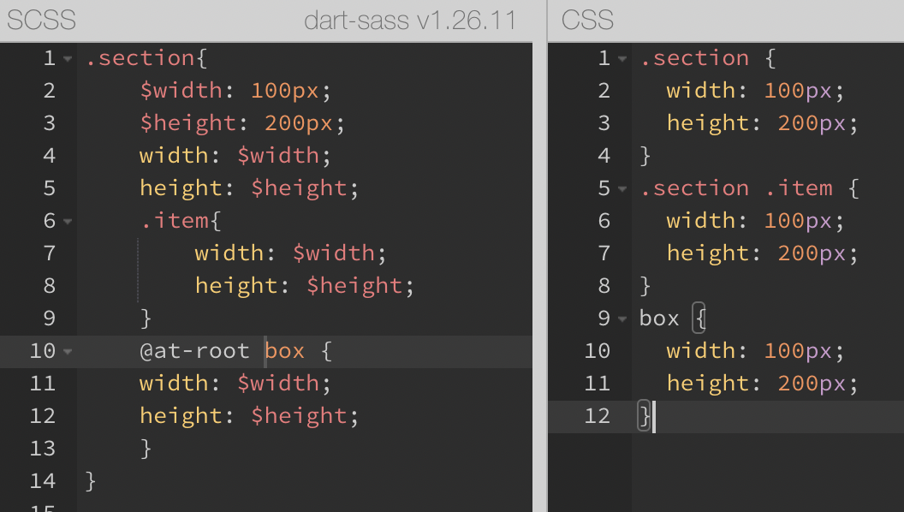

# Sass

## 개요

### Sass 개요

CSS는 쉬운 문법을 가지고 있지만, 많은 요소와 스타일링이 들어가면 코드를 보는 것도 어려워집니다. 불필요한 선택자(Selector)의 과용과 연산 기능의 한계가 있기 때문입니다. 프로젝트의 크기에 따라 관리가 힘들어 지는데, 이러한 면을 보완하고자 Sass가 탄생하였습니다.

#### CSS Preprocessor란?

CSS 전처리기는 전처리기 자신만의 문법을 가지고 CSS를 생성하는 프로그램입니다. 많은 CSS 전처리기가 있으며, 대부분 pure CSS에 존재하지 않는 특징을 추가할 수 있습니다. 대표적인 예로는 믹스인, 중첩 셀렉터, 상속 셀렉터가 있습니다. 
##### CSS Preprocessor 사용법

전처리기의 문법에 맞춰 코딩을 합니다. 웹에서는 pure CSS만 동작하기 때문에, 이를 CSS로 컴파일(Compile)합니다.

### Sass와 SCSS의 차이점

Sass(Syntactically Awesome Style Sheets)의 3버전에서 SCSS가 등장하였습니다. SCSS는 CSS의 모든 레벨과 호환되도록 만든 새로운 문법 체제입니다. 따라서 Sass의 모든 기능을 지원하는 CSS의 상위집합(Superset)입니다.

즉, SCSS는 CSS와 거의 같은 문법으로 Sass를 지원한다고 볼 수 있습니다. 공식 문서에서도 SCSS문법을 기반으로 모든 문법을 설명하고 있습니다.


또 다른 차이점으로는 `{}`(중괄호)와 `;`세미콜론의 유무입니다.

**예제**

Sass

```Sass
.list
    width: 100px
    float: left
    li
        color:red
        background: url("image.jpg")
        &:last-child
            margin-right: -10px
```

SCSS

```SCSS
.list {
    width: 100px;
    float: left;
    li {
        color: red;
        backgroud: url("image.jpg");
        &:last-child{
            margin-right: -10px
        }
    }
}
```

Sass는 선택자의 유효범위를 들여쓰기로 구분하고, SCSS는 `{}`로 범위를 구분합니다.

Sass가 들여쓰기로 유효범위를 정하기 때문에 같은 라인의 코드를 여러 줄로 나눠쓰는 것을 지원하지 않습니다. 이에 대한 [이슈](https://github.com/sass/sass/issues/216)는 아직 진행중입니다.

Mixins(재사용 가능한 기능을 만드는 방식)에도 차이가 있습니다. Sass는 단축 구문을 사용합니다.

Sass

```Sass
=border-radius($radius)
    -webkit-border-radius: $radius
    -moz-border-radius: $radius
    -ms-border-radius: $radius
    border-radius: $radius

.box
    +border-radius(10px)
```

SCSS
```SCSS
@mixin border-radius($radius) {
    -webkit-border-radius: $radius;
    -moz-border-radius: $radius;
    -ms-border-radius: $radius;
    border-radius: $radius;
}

.box {@include border-radius(10px);}
```

Sass는 `=`와 `+`기호로 Mixins을 사용했고, SCSS는 `@mixin`과 `@include`을 이용합니다.

### 컴파일 방법

Sass(SCSS)는 pure CSS가 아니기 때문에 웹에서 직접 동작할 수 없습니다. 따라서 이들을 CSS로 컴파일해야 합니다. 컴파일을 하는 방법들은 아래와 같습니다.

#### SassMeister

간단한 Sass 코드를 변환할 때 편리합니다. 페이지에 접속하고 Sass나 SCSS 문법으로 코딩하면 CSS창에 결과가 실시간 반영됩니다. HTML을 작성하여 적용된 결과를 보거나 Sass 버전 설정 등 여러 환경 설정들을 지원합니다.

||
|:--:|
|SassMeister 화면|

#### node-sass

node-sass는 Node.js를 컴파일러인 LibSass에 바인딩한 라이브러리입니다.
NPM으로 전역 설치하여 사용합니다.

```
$ npm install -g node-sass
```

컴파일하려는 파일의 경로와 컴파일된 파일이 저장될 경로를 설정합니다.
`[]`는 선택사항입니다.

```
$ node-sass [옵션] <입력파일경로> [출력파일경로]
```

```
$ node-sass scss/main.scss public/main.css
```

여러 출력 경로를 설정할 수 있습니다.

```
$ node-sass scss/main.scss public/main.css dist/style.css
```

옵션을 적용할 수도 있습니다.
`--watch` 혹은 `-w`를 입력하면, 파일을 추적하기 시작합니다. 이 상태에서 파일을 저장하면 자동으로 변경 사항을 컴파일 합니다.

```
node-sass --watch scss/main.scss public/main.css
```

#### Gulp

빌드 자동화 도구입니다. `gulpfile.js`를 만들어 아래와 같이 설정할 수 있습니다. 먼저 `gulp` 명령을 사용하기 위해서는 전역 설치가 필요합니다.

```
$ npm install -g gulp
```

Gulp와 함께 Sass 컴파일러인 gulp-sass를 개발 의존성(devDependency) 모드로 설치합니다. gulp-sass는 위에서 살펴본 node-sass를 Gulp에서 사용할 수 있도록 만들어진 플러그인입니다.

```
$ npm install --save-dev gulp gulp-sass
```

#### Webpack

JavaScript 모듈화 도구입니다.

#### Parcel

웹 애플리케이션 번들러입니다. 사용 방법은 다음과 같습니다.

우선 Parcel을 전역으로 설치합니다.

```
$ npm install -g parcel-bundler
```

프로젝트에 Sass 컴파일러(node-sass)를 설치합니다.

```
$ npm install --save-dev node-sass
```

HTML에 `<link>`로 Sass 파일을 연결합니다.

```html
<link rel="stylesheet" href="scss/main.scss">
```

```
$ parcel index.html
# 혹은
$ parcel build index.html
```

`dist/`에서 컴파일된 Sass 파일을 볼 수 있고, 별도의 포트 번호를 설정하지 않았다면 `http://localhost:1234`에 접속하여 적용 상태를 확인할 수 있습니다.

**예시**

아래와 같이 HTML과 SCSS파일을 작성합니다

```html
<!DOCTYPE html>
<html lang="ko-KR">
<head>
    <meta charset="UTF-8">
    <meta http-equiv="X-UA-Compatible" content="IE=edge">
    <meta name="viewport" content="width=device-width, initial-scale=1.0">
    <title>SCSS test</title>
    <link rel="stylesheet" href="main.scss">
</head>
<body>
    <div class="container">
        <div class="item"></div>
    </div>
</body>
</html>
```

```SCSS
.container{
    $size : 100px;
    .item {
        width: $size;
        height: $size;
        background: tomato;
    }
}
```

여기서 같은 경로의 터미널에 아래와 같이 커맨드를 입력합니다.

```
$ npm init -y
```

위 커맨드를 실행하면 package.json파일이 다음과 같이 생성됩니다.

```json
{
  "name": "sass_test",
  "version": "1.0.0",
  "description": "",
  "main": "index.js",
  "scripts": {
    "test": "echo \"Error: no test specified\" && exit 1"
  },
  "keywords": [],
  "author": "",
  "license": "ISC"
}
```

이제 아래 커맨드를 입력해서 parcel을 개발 의존성 모드로 설치합니다.

```
npm i -D parcel-bundler
```

터미널 실행이 끝나면 json 파일에 `parcel-bundler`과 추가된 것을 볼 수 있습니다.

```json
{
  "name": "sass_test",
  "version": "1.0.0",
  "description": "",
  "main": "index.js",
  "scripts": {
    "test": "echo \"Error: no test specified\" && exit 1"
  },
  "keywords": [],
  "author": "",
  "license": "ISC",
  "devDependencies": {
    "parcel-bundler": "^1.12.5"
  }
}
```

이제 결과를 확인할 차례입니다.

```
$ npx parcel index.html
```

parcel을 통해 번들링 과정을 마치면 아래와 같이 서버를 확인할 수 있는 주소를 보여줍니다. 이 과정에서 percel은 `link`에 걸린 파일의 종류에 따라 모듈 설치를 자동으로 합니다.

||
|:--:|
|번들링 과정이 끝난 후 터미널 화면|

||
|:--:|
|렌더링 화면|

## 문법

### 주석(Comment)

CSS 주석은 `/* ... */`입니다.
Sass는 두 가지 스타일의 주석을 사용합니다.

```sass
// comment
/* comment */
```

Sass의 경우 컴파일되는 여러 줄 주석을 사용할 때 각 줄 앞에 `*`을 붙여야 합니다. 이 때 주의할 점은 `*`의 라인을 맞춰야 합니다.

```sass
/* 컴파일되는
 * 여러 줄
 * 주석 */
```
SCSS는 각 줄에 `*`이 없어도 되기 떄문에 기존 CSS와 주석방식이 같습니다. 따라서 기존 CSS와의 괴리감이 줄어듭니다.

### 데이터 종류(Data Types)

|데이터|설명|예시|
|:--:|:--|:--|
|Numbers|숫자|`1`, `82`, `20px`, `2em` ...|
|String|문자|`bold`, `relative`, `"a.png"`, `"dotum"` ...|
|Colors|색상 표현|`red`, `blue`, `#FFFF00`, `rgba(255, 0, 0, .5)` ...|
|Booleans|논리|`true`, `false`|
|Nulls|아무것도 없음|`null`|
|Lists|공백이나 `,`로 구분된 값의 목록|`(apple, orange, banana), apple oragne`|
|Maps|Lists와 유사하나 `Key: Value` 형태|`(apple: a, orange: o, banana: b)`|

#### 데이터 타입 특징

Sass에서 사용하는 데이터 종류들의 특징이 있습니다.

- Numbers: 숫자에 단위가 있거나 없습니다.
- Strings: 문자에 따옴표가 있거나 없습니다.
- Nulls: 속성값으로 `null`이 사용되면 컴파일하지 않습니다.
- Lists: `()`를 선택하여 사용합니다.
- Maps: `()`가 필수 입력사항입니다.

### 중첩(Nesting)

Sass는 중첩 기능을 사용할 수 있습니다.
상위 선택자의 반복을 피하기 때문에 코드를 간결하게 구성할 수 있습니다.

SCSS:

```scss
.section{
    width: 100%;
    .list {
        padding: 20px;
        li {
            float: left;
        }
    }
}
```

Compiled to:

```css
.section{
    width: 100%;
}
.section .list{
    padding: 20px;
}
.section .list li{
    float: left;
}
```

### Ampersand(상위 선택자 참조)

중첩 안에서 `&`키워드는 상위(부모) 선택자를 참조하여 치환합니다. 

SCSS:

```scss
.btn{
    position: absolute;
    &.active {
        color: red;
    }
}

.list{
    li {
    &:last-child{
        margin-right: 0;
    }
    }
}
```

Compiled to:

```css
.btn{
    position: absolute;
}
.btn.active{
    color: red;
}
.list li:last-child{
    margin-right: 0;
}
```

||
|:--:|
|& 사용 화면|

Sass에서 & 사용시 공통으로 가지고 있는 상위 선택자에 대한 지정을 일일히 해주지 않아도 됩니다.

**&를 사용하지 않는다면?**

||
|:--:|
|상위 선택자 미사용 화면|

`&`를 사용하지 않을 경우 css로 컴파일 될 때 이중으로 클래스가 선택되는 것을 볼 수 있습니다. 이는 스타일링할 때 우선순위에 의해 다른 스타일링이 적용되지 않을 수도 있습니다.

### @at-root(중첩 벗어나기)

중첩에서 벗어나고 싶을 때 `@at-root` 키워드를 사용합니다. 중첩 안에서 생성하되 유효 범위 바깥에 있는 요소에 접근할 때 유용합니다.

SCSS:

```scss
.list {
    $w: 100px;
    $h: 50px;
    li {
        width: $w;
        height: $h;
    }
    @at-root .box{
        width: $w;
        height: $h;
    }
}
```

Complied to:

```css
.list li{
    width: 100px;
    height: 50px;
}
.box {
    width: 100px;
    height: 50px;
}
```

아래 예제 처럼 `.list`안에 있는 특정 변수를 범위 밖에서 사용할 수 없기 때문에, 위 예제처럼 `@at-root` 키워드를 사용해야 합니다.

**예시**

||
|:--:|
|@at-root 미사용 화면|

`box`클래스가 `section`클래스 안에 있습니다.

||
|:--:|
|@at-root 사용 화면|

`box`클래스가 `@at-root`로 인해 `section`영역에서 벗어났음을 볼 수 있습니다.

### 중첩된 속성

`font-`, `margin-`등과 같이 동일한 네임 스페이스를 가지는 속성들을 다음과 같이 사용할 수 있습니다.

SCSS:

```scss
.box{
    font: {
        weight: bold;
        size: 10px;
        family: sans-serif;
    };
    margin: {
        top: 10px;
        left: 20px;
    }
    padding: {
        bottom: 40px;
        right: 30px;
    }
}
```

Compiled to:

```css
.box{
    font-weight: bold;
    font-size: 10px;
    font-family: sans-serif;
    margin-top: 10px;
    margin-left: 20px;
    padding-bottom: 40px;
    padding-right: 30px;
}
```

<details>
<summary>참고자료</summary>
<a href="https://sass-lang.com/documentation">Sass 공식문서
<br>
</details>